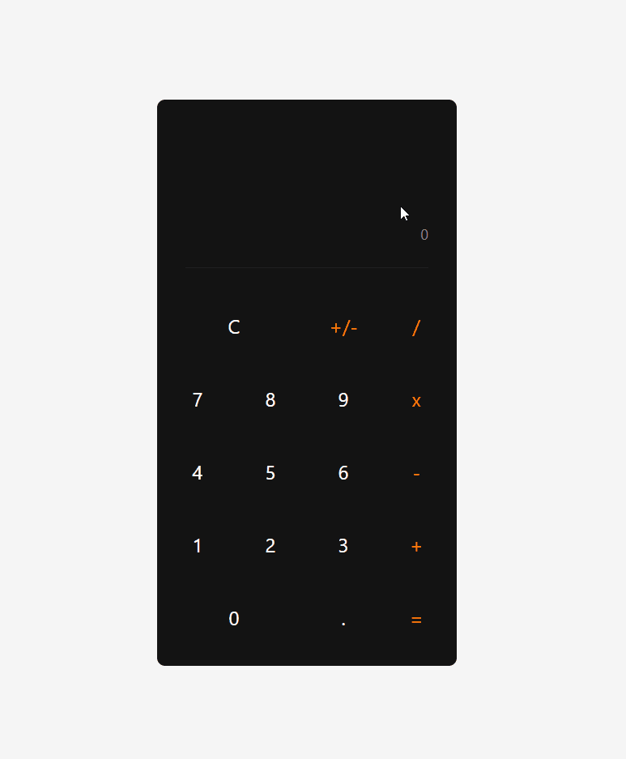

# simple-calculator

A fully functional basic calculator web application with a clean, user-friendly interface. Supports basic arithmetic operations, decimal inputs, and sign toggling with input validation to prevent overflow.

## Preview

## Features

- Basic arithmetic operations (+, -, ×, ÷)
- Decimal point support
- Sign toggle (+/-)
- Clear function
- Input length validation
- Result formatting for large numbers
- Mobile responsive design
